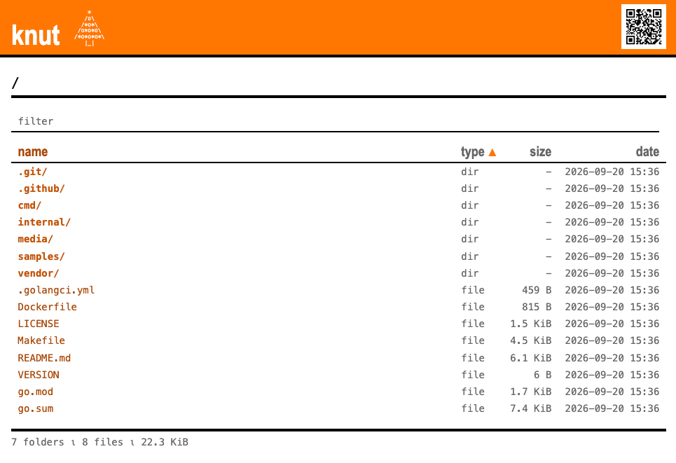
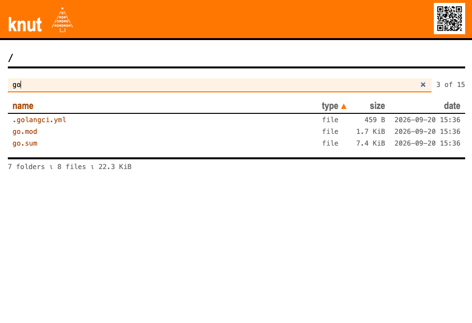
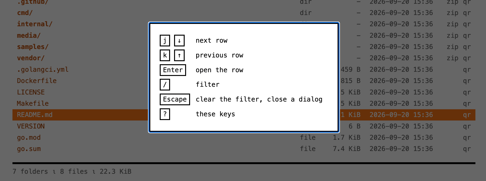

# *knut* - a tiny webserver which throws (file-) trees through a window

[](https://github.com/mgumz/knut/releases/latest)
[](https://goreportcard.com/report/github.com/mgumz/knut)
[](https://github.com/mgumz/knut)
[](https://github.com/mgumz/knut/pkgs/container/knut)

I want to make 'folder1' and 'file2' of my home directory public, without
serving both resources on different http-ports, without exposing the rest
of my $HOME, without any copying of the files or folders to another place.

I also want to map resources to URIs, adhoc, without any complex config files
or any other voodoo.

And sometimes it's quite handy to just tell someone to POST stuff to a
httpd-resource.




## Usage

```
knut [opts] [uri:]folder-or-file [mapping2] [mapping3] [...]

Sample:

   knut file.txt /this/:. /ding.txt:/tmp/dong.txt

Mapping Format:

   file.txt                - publish the file "file.txt" via "/file.txt"
   /:.                     - list contents of current directory via "/"
   /uri:folder             - list contents of "folder" via "/uri"
   /uri:file               - serve "file" via "/uri"
   /uri:@text              - respond with "text" at "/uri"
   30x/uri:location        - respond with 301 at "/uri"
   @/upload:folder         - accept multipart encoded data via POST at "/upload"
                             and store it inside "folder". A simple upload form
                             is rendered on GET.
   /c.tgz:tar+gz://./      - creates a (gzipped) tarball from the current directory
                             and serves it via "/c.tgz"
   /z.zip:zip://./         - creates a zip files from the current directory
                             and serves it via "/z.zip"
   /z.zip:zipfs://a.zip    - list and servce the content of the entries of an
                             existing "z.zip" via the "/z.zip": consider a file
                             "example.txt" inside "z.zip", it will be directly
                             available via "/z.zip/example.txt"
   /uri:http://1.2.3.4/    - creates a reverse proxy and forwards requests to /uri
                             to the given http-host
   /uri:git://folder/      - serves files via "git http-backend"
   /uri:cgit://path/to/dir - serves git-repos via "cgit"
   /uri:myip://            - serves a "myip" endpoint, query-options:
                             fuzzy - /24 for ipv4; /56 for ipv6
                             info - api to use for meta data about the ip
                             supported: "ripe"

 Options:

  -auth string
    	use 'name:password' to require
  -bind string
    	address to bind to (default ":8080")
  -compress
    	handle "Accept-Encoding" = "gzip,deflate" (default true)
  -live
    	listings refresh themselves, uploads report progress (serves htmx at "/.knut/htmx.js")
  -log
    	log requests to stdout (default true)
  -select-addr
    	interactively select -bind address
  -serve-index
    	create a small index-page, listing the various paths
  -server-id string
    	add "Server: <val-here>" to the response (default "knut/dev-build")
  -show-qr
    	show a QR code to stdout pointing to '/' (useful only if -bind is distinct)
  -tee-body
    	dump request.body to stdout
  -tls-cert string
    	use given cert to start tls
  -tls-key string
    	use given key to start tls
  -tls-onetime
    	use a onetime-in-memory cert+key to drive tls
  -version
    	print version
```

## Directory Listings

A published folder is rendered as a table. Click a column header to sort by
it, click the same one again to turn the order around. The header of the
page carries a QR code of the URL on screen, to point a phone at.

The box above the table narrows the listing while you type. It runs in the
browser and asks the server nothing, so it needs no flag:



* terms are separated by spaces and all of them have to match: `go mod`
* `-term` excludes: `log -old` is every name carrying `log`, minus the ones
  carrying `old`
* matching ignores case and looks at the name alone
* a typo still finds the file: where nothing matches exactly, the search is
  repeated with one mistyped letter allowed per term
* the count on the right says how many of the entries are left, and `../`
  is never filtered away
* the query survives a click on a column header, so a listing can be
  narrowed and re-sorted in either order

Without JavaScript the box does not appear and the table is plain HTML,
like the rest of the page.

### Keyboard navigation

A bar marks one row of the listing:

| key      | does                          |
|----------|-------------------------------|
| `j`, `↓` | move the bar down one row     |
| `k`, `↑` | move the bar up one row       |
| `Enter`  | follow the row the bar is on  |
| `/`      | jump into the filter box      |
| `Escape` | empty the filter box          |
| `?`      | open the keybind overview     |





### Actions

Every action in the last column acts on the entry of its row: `zip` takes
the entry along, `qr` points a phone at it. The header of that column is
the folder on screen and carries the same actions for it. `qr` is offered
for every entry, `zip` only for a folder.

`zip` answers with the folder and everything below it as an archive:

* it is written while it is sent: no temporary file, and the size of the
  folder does not matter
* the files are deflated at the cheapest level, the folder entries stored
* empty folders travel along, symlinks, sockets and devices do not
* a folder inside a `zipfs://` mapping is copied out of that zip as it is
  stored: nothing is unpacked or packed again. entries whose names reach
  outside the folder are left out
* the name is the folder and the moment it was asked for:
  `sub-2026-09-19T15-04.zip`
* the URI is the folder plus `?zip`, so it can be fetched without the page:
  `curl -OJ 'http://host:8080/sub/?zip'`

`qr` opens a large code to scan on top of the listing, for the phone next to
the screen:

* the code carries the URL of the entry it hangs on: the one on `a.txt`
  downloads `a.txt`, the one on `sub/` opens the listing of `sub/`
* the URI is the entry plus `?qr`, drawn when it is opened
* a page reached as `localhost` or `127.0.0.1` offers no codes: the phone
  resolves such a URL itself and the request never leaves it. reach knut by
  a name or address the phone can use and the codes are there - the machine
  the browser runs on plays no part in it

## Git Repositories

`git://` publishes the repositories in a folder, or a single repository,
through `git http-backend`. The URL to clone from is also a page for the
browser:

    $> knut /g:git://~/src/
    $> git clone http://host:8080/g/knut/

* the page lists the `git clone` command, the branches and tags, and the
  log of `HEAD`, 50 commits at a time: with `-live` the next 50 load when
  the end of the log scrolls into view, without it an "older commits" link
  pages through, and "newer commits" and "latest" page back
* git clients ask for fixed paths below the repository (`info/refs`,
  `git-upload-pack`, `objects/...`); those go to `git http-backend`,
  everything else gets the page
* a working tree (`knut/.git`) and a bare repository (`knut.git/`) both
  have a page
* mapping a folder trusts the repositories in it, whoever owns them: git
  refuses a repository of another user ("dubious ownership"), knut tells
  it `safe.directory` for everything below the mapping
* a folder holding repositories lists them: the branch `HEAD` is on, the
  date and subject of its commit. folders one level down which hold
  repositories of their own (`org/repo.git`) are listed as folders. a
  folder without any repository is a 404
* `zip` takes the tree of `HEAD` along, the one on a branch or tag row that
  ref: `git archive` packs it, named after the repository and the ref -
  `curl -OJ 'http://host:8080/g/knut/?zip&ref=v1.0'`
* with `-live` both pages follow commits, pushes, new branches and tags
* `git push` is not a feature: `git http-backend` refuses it. a
  repository with `http.receivepack = true` in its own config accepts it
  anyway, from anyone who reaches knut - knut checks nothing of what is
  pushed, so don't set it on a published repository
* browsing trees, files and diffs is left to `cgit://`

## Live Views

`-live` makes the rendered pages move:

    $> knut -live /:. @/upload:/tmp/incoming

* a listing refreshes itself. it holds one request open at the server,
  which the filesystem wakes the moment the folder changes - a file
  dropped into it shows up at once, and the chosen sort order survives the
  refresh. nothing is scanned on a timer: a folder nobody looks at costs
  nothing, and a folder ten people look at is watched once.
* the pages of `git://` do the same with the refs of a repository: a
  commit, a push, a new branch or tag shows up at once
* the upload form posts in place and reports how far the bytes got. the bar
  measures the upload, so it stands at 100% while the last of it is still
  being written - the note next to it says so.

With `-live` *knut* watches the folders it lists, for as long as a listing
is on screen. And it answers `/.knut/htmx.js` itself - that is where it
serves [htmx](https://htmx.org) - so a file of that name cannot be served
from a published tree. *knut* warns at startup if a mapping claims it.

Live listings lean on the filesystem reporting its own changes (inotify,
kqueue, `ReadDirectoryChangesW`). A tree served off a network mount - NFS,
SMB - reports nothing of the sort: such a listing renders and stays put
until it is reloaded by hand.

To vendor another htmx release:

    $> go generate ./internal/pkg/knut/view

## Text for the Terminal

A client which does not ask for HTML gets the pages as plain text: curl,
wget, a script. Browsers ask for HTML and get the page.

    $> curl http://host:8080/d/
    300 B    2026-09-19 13:04  b.txt
    2.9 KiB  2026-09-19 14:04  big.bin
    -        2026-09-19 16:04  sub/

* one line per entry, the columns lined up, the name last. `?sort=` and
  `?order=` work the same as on the page
* the page of a git repository: the `git clone` line, the refs, 50 commits,
  and the URL of the next 50 (`older:`)
* the repo list, the index, `myip` (the address alone), the answer to an
  upload (`curl -F f=@file host:8080/upload`), and every error: `404 Not
  Found`
* `?text` and `?html` pick the form, whatever the client asks for
* downloads, `?zip` and `?qr` are what they were

## Build & Installing

The only requirement to build *knut*: A working go-compiler. Check
https://go.dev for more information on how to setup one. If you
have a working golang-compiler:

    $> go install github.com/mgumz/knut/cmd/knut@latest
    $> ~/go/bin/knut -h

If you *need* to install something:

    $> cp ~/go/bin/knut /path/to/final/place

## Container Image

Multi-arch (`linux/amd64`, `linux/arm64`) OCI images are published to the
GitHub Container Registry on every tagged release:

    $> podman pull ghcr.io/mgumz/knut:latest

Serve the current directory via `/`, mapping the container port to the host:

    $> podman run --rm -p 8080:8080 -v "$PWD:/data" ghcr.io/mgumz/knut:latest /:/data

Pin a specific version with a tag, e.g. `ghcr.io/mgumz/knut:1.7.0`. The
image bundles `git` and `cgit`, so the `git://` and `cgit://` handlers work
out of the box.

## The name

*knut* or "St. Knut's day" is an annually celebrated festival in sweden /
finland on 13 January. It marks the end of christmas. Among other
activities, the christmas trees 🎄🎄 are disposed. Get inspired:

* https://youtu.be/watch?v=OGpGGONbTwY
* https://youtu.be/watch?v=nEf5yuyaXgk
* https://youtu.be/watch?v=IBhC4UevoaA
